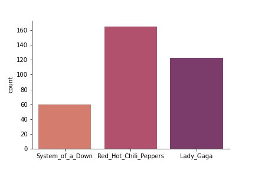
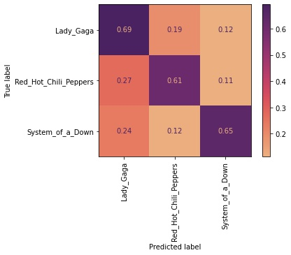
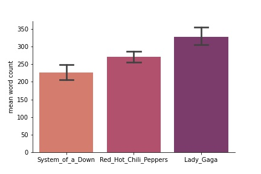
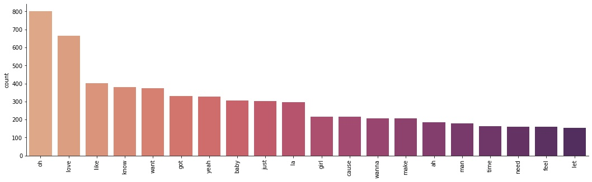
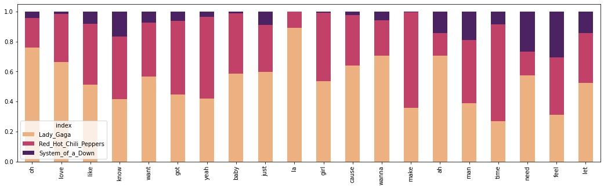
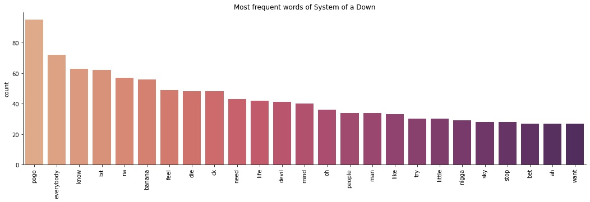

## Red Hot Chili Peppers vs. Lady Gaga vs. System of a Down

This weeks project is to program a web-scraper that automatically graps the lyrics of two artists from www.lyrics.com and with that to train a classificiation model which can predict, wether the lyrics are from one or the the other artist.

### 1. The Lyrics Scraper

My Lyrics-Scraper needs the following input:

- URL of the Artist Page of www.lyrics.com
- The Artist Name
- The path where to save the html files

It checks for duplicate songs before saving the htmls on the hard drive and it gives a status of which song of how many is downloaded (Red Hot Chili Peppers: 199 songs, Lady Gaga: 133 songs)

### 2. Lyrics 2 csv

A second program extracts the pure lyrics from the htmls and saves it together with the artist name and the song title in a csv file. It recognizes, if there are lyrics missing in an html file.

### 3. The Data Set

I scraped the lyrics of Lady Gaga, Red Hot Chili Peppers and System of a Down (first I only tried to compare Lady Gaga and Red Hot Chili Peppers, but they seemed to be not different enough. So I added System of a Down as a high contrast to Lady Gaga. At least this was my plan... )

The distribution of the songs count in my data set is shown below.

 

Most of the lyrics are from Red Hot Chili Peppers (165), followed by Lady Gaga (123) and System of a Down (60). The imbalance of the song count I took into account when building the model. 

### 4. The Model

I used a **RandomForestClassifier** together with a **CountVectorizer** for transforming the words into numerical data. I used a grid search cross validation for tuning the hyper-parameters but I found out, that all models were very sensitive to the training data and the cross validation didn't show repeatable results. In the end I figured out that the following parameters work ok and stable.

`CountVectorizer(stop_words='english',ngram_range=(1,1), min_df=2, max_df=0.85)`

`RandomForestClassifier(max_depth=10, n_estimators=50, class_weight='balanced', ccp_alpha=0.0001)`

The confusion matrix of the results is displayed below. The accuracy of the predicted values ist 66.6% while the baseline accuracy is 52.87% for only predicting Red Hot Chili Peppers.

The figure shows, that the model has problems to differentiate between Lady Gaga and Red Hot Chili Peppers, but it is pretty sure, that Lady Gaga songs can not be from System of a Down but lyrics from System of a Down are more likely from Lady Gaga than from Red Hot Chili Peppers.

### 5. Evaluating the Model

Due to the fact that the CountVectorizer is very transperent in its approach, I had a closer look on some words staticstics.

The data set has most lyrics from Red Hot Chili Peppers, but does that mean, that they also have the highest word count? The figure below shows, that Lady Gaga has the highest mean word count followed by Red Hot Chili Peppers and System of a Down.

After removing stop words and words that appear in more than 85% of the lyrics corpus with the CountVectorizer, here are the top 20 words of all the lyrics:

 At first I thought that words like 'oh', 'love' and 'yeah' are buzz words with a similar meaning like stop words, but when I took a look at how often these words are used by the three artists (see figure below) it seems as they could at least in this special case give a good guess.

Most of the 'oh's and 'la's are from Lady Gaga. She sings of love more often than Red Hot Chili Peppers (and much more than System of a Down). Most of the 'yeah's are from Red Hot Chili Peppers and Lady Gaga and Red Hot Chili Peppers both like to sing about girls while System of a Down don't. What is interesting here is that although Red Hot Chili Peppers have the greates amount of songs, Lady Gaga has the highest share of the most frequent words (maybe because of many repetitions of the chorus). But in general all most frequent words are used by Lady Gaga and Red Hot Chili Peppers quite equally so maybe this could be a reason, why the model has problems to differentiate between those two artists.

System of a Down have a very low share of the most frequent words, so what are they singing about? The picture below gives the answer:

Words like 'feel', 'die' and 'devil' you could have guessed, but why do they sing so often about bananas? Here is the banana song: https://www.lyrics.com/lyric/8523355/System+of+a+Down/Vicinity+of+Obscenity.

### 6 The Artist Predictor

I saved the classification model and wrote a python script that predicts which of the three artists could have written the text that is provided via the command line. As I know what signiture words the artists have, I tried the predictor with the following text pieces, which I've created.

Lady Gaga: *"Oh oh my love oh I just want fame like a baby"*

Red Hot Chili Peppers: *"yeah you make me want to love a girl"*

System of a Down: *"everybody know that the devil likes banana and pogo"*

This worked very well, so the predictor gave me the correct answer in every case.

